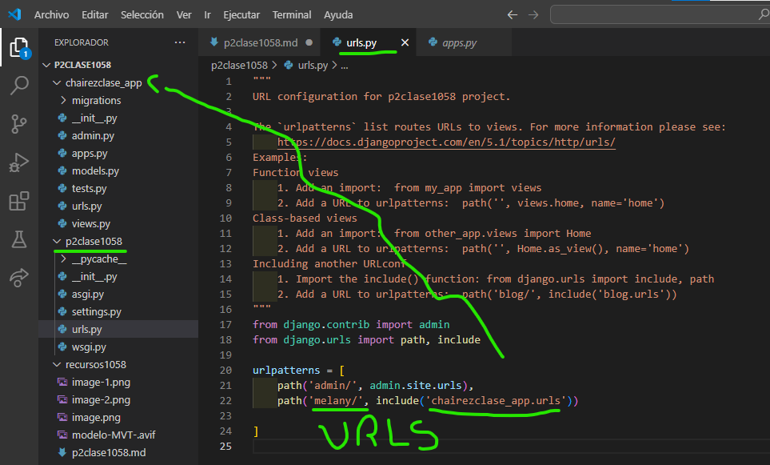
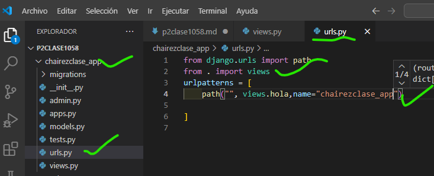

-crear aplicacion chairezclase_app
-comando --> python manage.py startapp chairezclase_app
-creamos el archivo urls.py en chairezclase_app
- 
- en setting.py de p2clase1058
- 
- en urls.py de p2clase1058
- 
- en urls.py de chairezclase_app
- 
- en views.py en chairezclase_app
- 
- en urls.py de chairezclase_app
- 